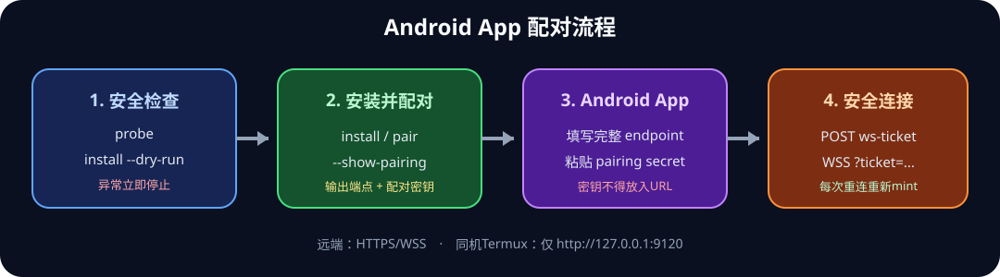
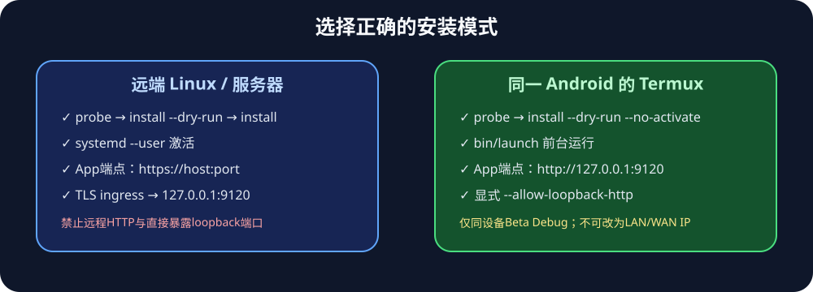

# Hermes Mobile Android Beta 0.2.0：安装与配对

> Beta 不是正式商店版本。唯一下载入口：
> https://github.com/snowzlmbot/hermes-agent/releases

下载 `hermes-mobile-android-beta.apk` 和 `SHA256SUMS.txt`，校验后安装：

```bash
sha256sum -c SHA256SUMS.txt
adb install -r hermes-mobile-android-beta.apk
```

## 让 Agent 安装服务器附加资源

把下面整段发给运行官方 Hermes 的 Agent：

> 请阅读并严格执行此安装说明：
> https://github.com/snowzlmbot/hermes-agent/blob/hermes-agent-Mobile-app/apps/mobile/gateway/README.md
> 只安装 `~/.hermes/mobile-gateway` 下的附加资源，不修改或升级官方 Hermes。先执行 `probe` 和 `install --dry-run`；如果检测到已有服务、权限异常、未知 systemd 状态或端口冲突，立即停止并报告。真实安装时使用 `--show-pairing`，最终只向主人输出 Android App endpoint 与 pairing secret。

服务器命令顺序：

```bash
HERMES_BIN="$(command -v hermes)"
HERMES_PYTHON="/absolute/path/to/official/.venv/bin/python"
MOBILE_ENDPOINT="https://host-or-ip:tls-port"
python3 apps/mobile/gateway/install.py probe --hermes "$HERMES_BIN" --python "$HERMES_PYTHON"
python3 apps/mobile/gateway/install.py install --dry-run --hermes "$HERMES_BIN" --python "$HERMES_PYTHON" --endpoint "$MOBILE_ENDPOINT"
python3 apps/mobile/gateway/install.py install --hermes "$HERMES_BIN" --python "$HERMES_PYTHON" --endpoint "$MOBILE_ENDPOINT" --show-pairing
```

## App 配对



1. `Gateway address`：填写命令输出的完整 endpoint，包含 `https://` 和端口。
2. `Session token`：粘贴 `Android App pairing secret`。
3. 远端服务器不要启用明文；只有同机Termux的 `http://127.0.0.1:9120` 才启用。
4. 点击 Connect；连接后打开会话列表并测试一次重连。
5. 不要填写 `websocket_url`，不要把secret放入URL、截图或群聊。

## 同机 Android Termux



Termux不使用systemd，运行：

```bash
HERMES_BIN="$(command -v hermes)"
HERMES_PYTHON="$(python3 -c 'import sys; print(sys.executable)')"
python3 apps/mobile/gateway/install.py probe --hermes "$HERMES_BIN" --python "$HERMES_PYTHON"
python3 apps/mobile/gateway/install.py install --dry-run --no-activate --hermes "$HERMES_BIN" --python "$HERMES_PYTHON" --endpoint http://127.0.0.1:9120 --allow-loopback-http
python3 apps/mobile/gateway/install.py install --no-activate --hermes "$HERMES_BIN" --python "$HERMES_PYTHON" --endpoint http://127.0.0.1:9120 --allow-loopback-http --show-pairing
termux-wake-lock
~/.hermes/mobile-gateway/bin/launch
```

保持最后命令前台运行。完整安全、状态、卸载和故障规则见 [`../gateway/README.md`](../gateway/README.md)。
